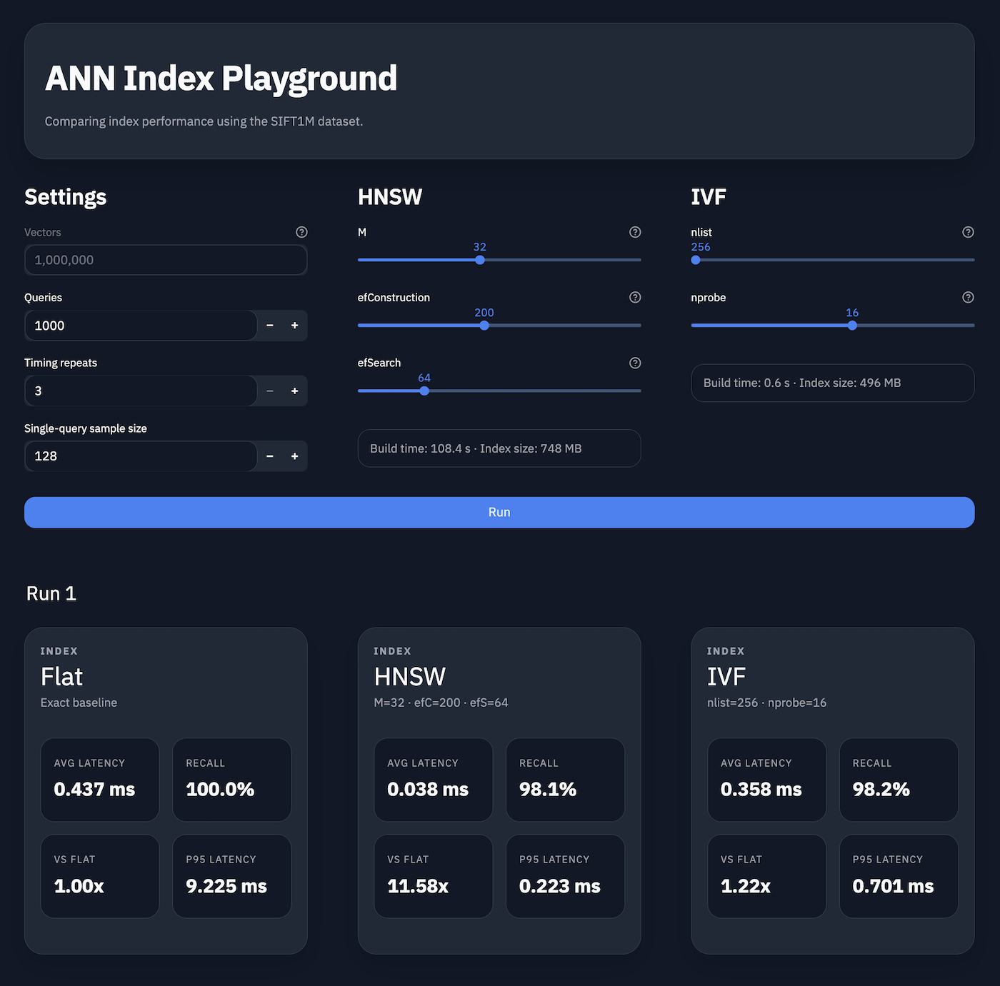

# ANN Index Playground

An interactive local app for explaining why vector indexes exist and how `Flat`, `HNSW`, and `IVF` behave differently on the SIFT1M dataset.

This repo was created as a companion app for a YouTube video. The goal is not to produce a full benchmark suite or a production retrieval system. The goal is to make ANN trade-offs visible and demoable by changing a few parameters and rerunning the comparison.



## About

This repository is a teaching and demo app for approximate nearest neighbor search, not a claim about what your production retrieval stack will do on real traffic.

The point of the app is to make the trade-offs visible:

- exact search gives you full recall, but the work scales with the dataset
- approximate indexes do less work, so they can be faster
- doing more work at query time usually increases recall
- doing less work at query time usually lowers latency

Those trade-offs are very real and they carry over to real systems. What does **not** carry over directly are the exact numbers.

This demo uses the ANN-Benchmarks `SIFT1M` dataset, which contains 128-dimensional SIFT image descriptors and precomputed nearest-neighbor ground truth. That makes it a useful benchmark dataset, but it is not a realistic modern text-embedding workload. Many semantic search and RAG systems use much higher-dimensional embeddings with very different data distributions.

So the safest way to read this repo is:

- the exact latency and recall numbers here are demo numbers
- the shape of the trade-off is the important part
- the behavior of `Flat`, `HNSW`, and `IVF` is what this app is meant to explain
- cross-backend numbers should be read as indicative rather than rigorous benchmarks

If you are trying to map this onto systems such as `pgvector`, Redis, or other vector databases, the intuition carries over better than the absolute timings. In a full database system, a query is not just hitting an ANN index. It may also go through planning, execution, filtering, and other database overhead. That changes the exact numbers, and it can shift where one index starts looking better than another. What remains useful is the behavior: more search work tends to buy more recall, and less search work tends to buy lower latency.

Contributions and improvements are welcome, especially if they make the demo clearer, more accurate, or easier to use without turning it into a full benchmark suite.

## What the app is for

The app is designed to help explain:

- why exact search is simple but expensive at larger scales
- why HNSW is often a strong default when recall matters
- why IVF is useful when you want faster build times and a tunable search surface
- how query-time tuning differs from build-time tuning
- how the same index can feel very different when you change `efSearch`, `nlist`, or `nprobe`
- how ANN trade-offs show up across `faiss`, `pgvector`, and `actian`

The UI is intentionally opinionated:

- it keeps the benchmark scope narrow
- it focuses on SIFT1M and Euclidean distance
- it favors side-by-side comparisons over raw charts
- it keeps previous runs visible so parameter changes are easy to compare

## What the app does

For each run, the app compares:

- `Flat`
- `HNSW`
- `IVF`

The app can run against three backends:

- `faiss`
- `pgvector`
- `actian`

It measures:

- average single-query latency
- p95 latency
- recall@10
- relative speed versus Flat

Preparation metadata is shown separately under the controls:

- `faiss` shows stored index size for `Flat`, `HNSW`, and `IVF`
- `faiss` shows `Build time` for `HNSW` and `IVF`
- `pgvector` and `actian` show backend-specific `Prep time` for `HNSW` and `IVF`

## Dataset

This app expects the ANN-Benchmarks SIFT1M HDF5 dataset at:

```text
data/sift-128-euclidean.hdf5
```

If you do not already have it, download it with:

```bash
just download-data
```

## Why SIFT1M and L2

This repo uses the classic SIFT1M benchmark because it is well-known and keeps the story simple.

- dataset: `SIFT1M`
- distance metric: `L2` / Euclidean distance
- nearest-neighbor target: `k = 10`

The app measures `recall@10` by comparing each approximate result set against the exact `Flat` top-10 neighbors for the same queries. It also measures latency as warmed single-query latency across all backends so the numbers are at least directionally comparable, even though they are still not benchmark-grade production measurements.

## Setup

Install `just` if needed:

```bash
brew install just
```

This repo uses `uv` for:

- installing Python `3.14`
- creating the virtual environment
- syncing dependencies
- running local commands

The `just` commands in this repo assume `uv` is installed.

Then set up the project:

```bash
just setup
```

If you prefer to skip `just`, the equivalent commands are:

```bash
uv python install 3.14
uv venv --python 3.14 .venv
uv sync --group dev
```

## Running the app

Launch the Streamlit UI with:

```bash
just ui
```

If you prefer to run it directly without `just`:

```bash
uv run streamlit run ann_app.py
```

## Backend selection

Backend choice is controlled through `.env`:

```env
ANN_BACKEND=faiss
```

Supported values:

- `faiss`
- `pgvector`
- `actian`

`faiss` is the default.

For `pgvector`, the app also reads:

```env
PGVECTOR_DATABASE_URL=postgresql:///ann_indexes_pgvector
PGVECTOR_ADMIN_DATABASE_URL=postgresql:///postgres
PGVECTOR_MAINTENANCE_WORK_MEM=512MB
```

The admin database URL is used only to create the target database if it does not already exist.
`PGVECTOR_MAINTENANCE_WORK_MEM` is applied at the session level during HNSW/IVF index builds so larger local datasets do not fail on PostgreSQL's default 64 MB maintenance memory limit.

For `actian`, the app reads:

```env
ACTIAN_VECTORAI_URL=localhost:50051
```

That URL points at the running Actian VectorAI DB gRPC server.

## Using the Actian backend

The Actian integration uses the official Python SDK as a client and a separately running VectorAI DB server.

There is not a Python-only embedded database mode in the upstream package. In live validation, the Python dependency alone only provides the client and returns a connection error until the server is running.

The simplest setup in this repo is Docker:

```bash
just actian-up
```

Or without `just`:

```bash
docker compose -f docker-compose.actian-vectorai.yml up -d
```

Then set `.env`:

```env
ANN_BACKEND=actian
ACTIAN_VECTORAI_URL=localhost:50051
VECTOR_COUNT=1000000
INCLUDE_HNSW=true
INCLUDE_IVF=true
```

And launch the app:

```bash
just setup
just ui
```

To stop the container:

```bash
just actian-down
```

Notes:

- the SDK is installed from the upstream wheel URL defined in [pyproject.toml](/Users/rb/Projects/Actian/ann-indexes/pyproject.toml)
- the current upstream Docker image worked correctly for `Flat`, `HNSW`, and `IVF` in live testing
- each Actian index family is built in its own collection: one `Flat` collection, one `HNSW` collection, and one `IVF` collection
- for the validated upstream image, IVF collections only became searchable after `rebuild_index()` followed by `open_collection()`, so the backend performs that explicitly after loading IVF data
- on the validated `Actian VectorAI DB 1.0.0 / VDE 1.0.0` image, query-time `ivf_nprobe` overrides appeared to be ignored by the server, so the app materializes separate Actian IVF collections for each `nlist` / `nprobe` pair instead
- the side-panel timing label depends on the backend:
- `faiss` uses `Build time` because it is building the index in-process
- `pgvector` and `actian` use `Prep time` because the setup cost includes backend-specific work beyond pure index construction
- these are still not strict apples-to-apples build benchmarks across backends
- Docker overhead should be small relative to the ANN work because the client already talks to a separate gRPC server; the main thing to avoid is bind-mounting the whole project into the container, which this repo does not do
- the default Docker Compose setup stores persisted Actian data in the named Docker volume `actian-vectorai-data`

## Using the pgvector backend

The pgvector backend is partly automatic, but not completely zero-setup.

The app will do these steps for you:

- create the target database if it does not exist
- run `CREATE EXTENSION IF NOT EXISTS vector` in that database
- create the required tables
- build the HNSW and IVFFlat indexes it needs

These machine-level prerequisites must already be true:

- PostgreSQL is installed
- the PostgreSQL server is running
- the `vector` extension is installed for that Postgres instance
- your local user can connect and create databases

On macOS with Homebrew, the setup looks like:

```bash
brew install postgresql@18
brew services start postgresql@18
brew install pgvector
```

Sanity-check the server:

```bash
psql postgres
```

Then set `.env`:

```env
ANN_BACKEND=pgvector
PGVECTOR_DATABASE_URL=postgresql:///ann_indexes_pgvector
PGVECTOR_ADMIN_DATABASE_URL=postgresql:///postgres
PGVECTOR_MAINTENANCE_WORK_MEM=512MB
VECTOR_COUNT=1000000
INCLUDE_HNSW=true
INCLUDE_IVF=true
```

And launch the app normally:

```bash
just setup
just ui
```

If you want to force the pgvector backend to rebuild its tables and indexes from scratch, reset the app database first:

```bash
just reset-pgvector
```

That drops and recreates only the database pointed to by `PGVECTOR_DATABASE_URL`.

Important caveat:

- if `pgvector` was installed against a different Postgres version than the server you are running, extension creation can fail
- if your Postgres auth or local socket setup differs from the defaults, you may need to adjust the connection URLs in `.env`

## Vector count configuration

The number of indexed vectors is controlled through `.env` rather than hardcoded in the app:

```env
VECTOR_COUNT=1000000
```

If you change `VECTOR_COUNT`, restart the app so the new value is picked up.

This setting matters a lot:

- it changes index build time
- it can meaningfully change latency and recall behavior

The app currently treats vector count as an app-level setting, not a live in-UI control, because cached index files are keyed by that value.

## Saved results

Each time you click `Run`, the app appends the current results to:

```text
data/results.csv
```

This file is intended as a simple inspection log so you can compare runs across:

- different parameter settings
- different app sessions
- different backends such as `faiss`, `pgvector`, and `actian`

Each saved row includes run metadata plus the per-index result values, such as:

- timestamp
- backend
- vectors
- queries
- index family
- config text
- average latency
- p95 latency
- recall
- speedup versus Flat

The CSV is not shown in the app UI anymore. Inspect it directly if you want a persistent record of previous runs.

## Caching behavior

Caching depends on the selected backend.

### FAISS

The app writes serialized indexes into `cache/`.

These caches are reused when the build-time configuration matches:

- `Flat`: keyed by vector count
- `HNSW`: keyed by vector count, `M`, and `efConstruction`
- `IVF`: keyed by vector count and `nlist`

That means these changes do not require a rebuild:

- `Queries`
- `Timing repeats`
- `Single-query sample size`
- `HNSW efSearch`
- `IVF nprobe`

These changes do require a rebuild:

- `VECTOR_COUNT`
- `HNSW M`
- `HNSW efConstruction`
- `IVF nlist`

### pgvector

The app stores its artifacts in PostgreSQL instead of on disk.

It creates:

- one exact `Flat` table
- one `HNSW` table with HNSW indexes
- one `IVF` table with IVFFlat indexes

This table split is deliberate. It avoids planner ambiguity when both approximate index types exist at once, so the app can compare `Flat`, `HNSW`, and `IVF` in the same UI without guessing which index PostgreSQL used.

The pgvector backend also creates a small metadata table to store:

- index build time

Build-time cache keys for pgvector are effectively:

- `HNSW`: vector count, `M`, `efConstruction`
- `IVF`: vector count, `nlist`

Query-time-only changes still avoid rebuilds:

- `Queries`
- `Timing repeats`
- `Single-query sample size`
- `HNSW efSearch`
- `IVF nprobe`

## Understanding the controls

Current shared UI defaults:

- `HNSW`: `M=32`, `efConstruction=200`, `efSearch=64`
- `IVF`: `nlist=1024`, `nprobe=32`

### Search settings

- `Vectors`
  - read-only in the UI
  - comes from `.env`
- `Queries`
  - how many queries are used for the current comparison
  - more queries means slower runs but more stable averages
- `Timing repeats`
  - how many times the query loop is repeated for average timing
- `Single-query sample size`
  - how many individual queries are timed to estimate p95 latency

### HNSW

- `Connections per node (M)`
  - how many connections each node keeps in the graph
  - higher values usually improve recall and make navigation easier, but increase memory use and build time
- `Build effort (efConstruction)`
  - how much effort is spent building the graph
  - higher values usually create better connections, which improves recall, but increase build time
- `Search effort (efSearch)`
  - how many candidates are explored during search
  - higher values usually improve recall, but increase query latency
  - the HNSW slider bounds are kept in a practical range based on common documented defaults and tuning ranges across pgvector, Milvus, and Qdrant rather than exposing arbitrarily tiny or huge values

### IVF

- `Clusters (nlist)`
  - how many coarse clusters IVF creates when grouping vectors
  - the default starts near the square-root scale of the dataset size, which is a common practical starting point for IVF
  - the UI uses a graduated practical set of `nlist` values so you can explore structure changes without turning the control into micro-tuning
  - higher values make search more selective, but increase build cost and make tuning more important
- `Clusters searched (nprobe)`
  - how many IVF clusters are searched for each query
  - the default starts near the square-root scale of `nlist`, which is a common practical starting point for probes
  - the UI uses a denser practical set of probe values so tuning is easier than a pure powers-of-two scale
  - higher values usually improve recall by searching more of the space, but increase query latency
  - for the current Actian demo, each `nlist` / `nprobe` combination is prebuilt because the validated server image does not support changing `nprobe` at query time

## Reading the results

Each run is kept on screen so you can compare changes over time.

The result cards show:

- `Avg Latency`
- `Recall`
- `Vs Flat`
- `p95 Latency`

Recall is displayed as a percentage for readability.

`Vs Flat` is the relative speedup versus exact search:

- above `1.0x` means faster than Flat
- `1.0x` means the same as Flat
- below `1.0x` means slower than Flat

The control-group summaries are intentionally where prep/build context lives:

- `Flat stored index` in the `Settings` column for `faiss`
- `Build time` for `faiss`, or backend-specific `Prep time` for `pgvector` and `actian`
- for `faiss`, stored index size in the `HNSW` and `IVF` columns

That keeps the run-to-run cards focused on the metrics that actually change with search settings.

## Developer commands

```bash
just ui
just actian-up
just actian-down
just format
just lint
just pylint
just pyright
just check
just fix
just test
just reset-pgvector
just clean
```

Direct `uv` equivalents:

```bash
uv run streamlit run ann_app.py
uv run black .
uv run ruff check .
uv run pylint ann_actian.py ann_app.py ann_backend.py ann_faiss.py ann_pgvector.py tests/test_actian_backend.py tests/test_backend_contract.py tests/test_pgvector_backend.py
uv run pyright
uv run pytest
```

## Code layout

- [ann_app.py](./ann_app.py)
  - Streamlit UI, backend selection, and run history rendering
- [ann_backend.py](./ann_backend.py)
  - shared backend settings and the small backend contract used by the app
- [ann_faiss.py](./ann_faiss.py)
  - FAISS implementation, file-backed cache handling, and benchmark helpers
- [ann_pgvector.py](./ann_pgvector.py)
  - pgvector implementation, database/index setup, and PostgreSQL-backed search execution
- [ann_actian.py](./ann_actian.py)
  - Actian VectorAI DB implementation and benchmark helpers for the remote service backend
- [pyproject.toml](./pyproject.toml)
  - project configuration, linting, and Python/tooling settings
- [justfile](./justfile)
  - convenience commands for setup and local development
- [docker-compose.actian-vectorai.yml](./docker-compose.actian-vectorai.yml)
  - local container definition for running the Actian VectorAI DB service
- [tests/test_actian_backend.py](./tests/test_actian_backend.py)
  - Actian integration tests against a running local VectorAI DB instance
- [tests/test_backend_contract.py](./tests/test_backend_contract.py)
  - FAISS backend contract tests on a tiny synthetic dataset
- [tests/test_pgvector_backend.py](./tests/test_pgvector_backend.py)
  - pgvector integration tests against a temporary PostgreSQL database

## Notes

- This app uses `faiss-cpu`, not a CUDA FAISS build.
- The pgvector backend requires PostgreSQL plus the `vector` extension to be installed and available to the server.
- Absolute timings are hardware-dependent.
- Relative behavior can still be useful for explanation, but should not be overclaimed as universally applicable.
